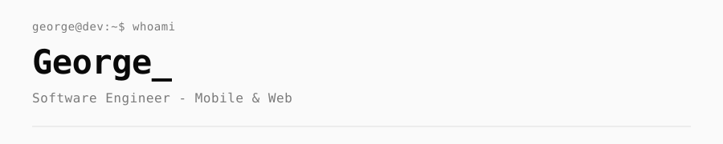
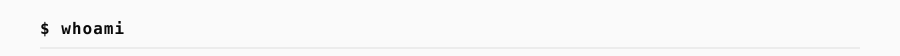
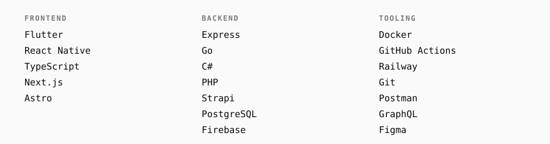
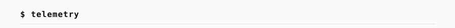

<picture><source media="(prefers-color-scheme: dark)" srcset="assets/dark/header.svg"/></picture>

<a href="https://github.com/hungrybeardev"><picture><source media="(prefers-color-scheme: dark)" srcset="https://img.shields.io/badge/GITHUB-0d1117?style=flat-square&logo=github&logoColor=ffffff"/></picture></a>
<a href="https://www.twitch.tv/hungrybeardev"><picture><source media="(prefers-color-scheme: dark)" srcset="https://img.shields.io/badge/TWITCH-0d1117?style=flat-square&logo=twitch&logoColor=ffffff"/></picture></a>

 

<picture><source media="(prefers-color-scheme: dark)" srcset="assets/dark/s01.svg"/></picture>
<picture><source media="(prefers-color-scheme: dark)" srcset="assets/dark/whoami.svg"/></picture>

<picture><source media="(prefers-color-scheme: dark)" srcset="assets/dark/s02.svg"/></picture>
<picture><source media="(prefers-color-scheme: dark)" srcset="assets/dark/stack.svg"/></picture>

<picture><source media="(prefers-color-scheme: dark)" srcset="assets/dark/s03.svg"/></picture>

<picture><source media="(prefers-color-scheme: dark)" srcset="https://github-readme-stats.vercel.app/api?username=hungrybeardev&show_icons=true&theme=default&hide_border=true&bg_color=0A0A0A&title_color=ffffff&text_color=cccccc&icon_color=ffffff"/></picture>
<picture><source media="(prefers-color-scheme: dark)" srcset="https://github-readme-stats.vercel.app/api/top-langs/?username=hungrybeardev&layout=compact&theme=default&hide_border=true&bg_color=0A0A0A&title_color=ffffff&text_color=cccccc"/></picture>

<picture><source media="(prefers-color-scheme: dark)" srcset="assets/dark/s04.svg"/></picture>
<picture><source media="(prefers-color-scheme: dark)" srcset="assets/dark/footer.svg"/></picture>
